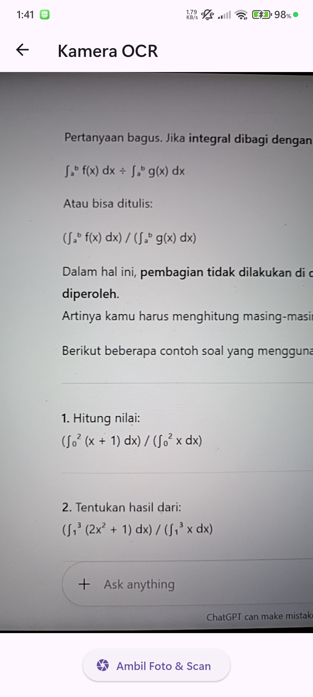
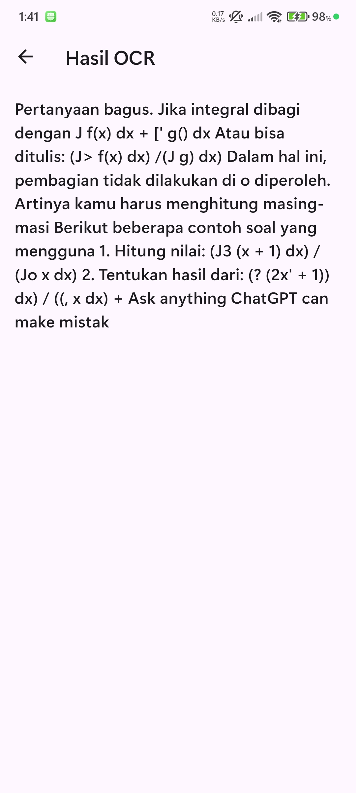
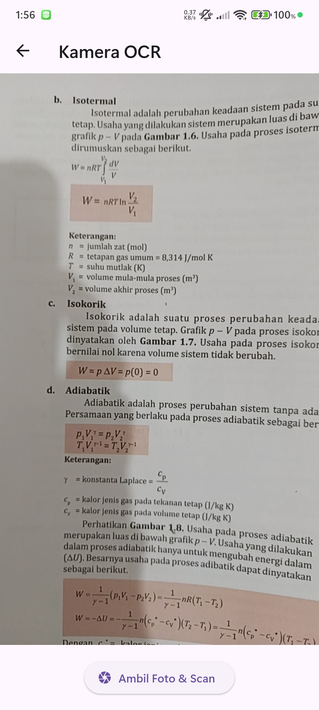
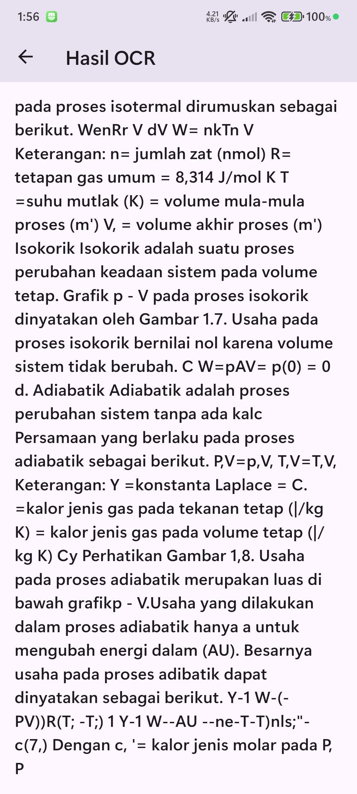
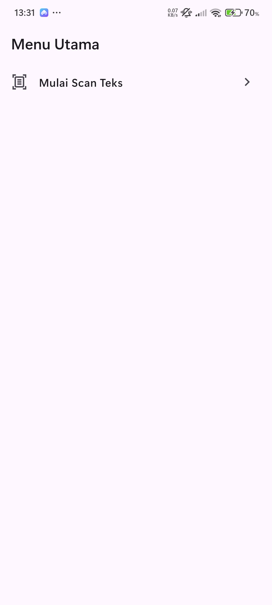

# flutter_application_5

A new Flutter project.

The main screen or starting point of your application. The display is very minimalist, containing only the title “Main Menu” and a single “Start Text Scan” button. The function of this screen is to direct users to start the scanning process.

The camera interface appears after the user presses the “Start Text Scan” button. The camera activates and is directed at a document containing text and mathematical notation, specifically integral formulas. At the bottom is the “Take Photo & Scan” button to take a picture and send it to the OCR process.

The screen shows the results after scanning a math document. The app successfully extracted the text, but the results aren't accurate. It's clear that the OCR model has trouble recognizing math symbols. For example, the integral symbol (∫) is misinterpreted as the letter ‘J’, and the equation format is messed up.

active camera view. This time, the camera is pointed at a page in a physics textbook that discusses thermodynamic concepts such as isothermal, isochoric, and adiabatic processes. This demonstrates the application's testing on different types of content (plain text interspersed with physics formulas).

The results screen for scanning physics books. As in the case of mathematics, plain text is read quite well. However, physics formulas and symbols become irregular and inaccurate when extracted. This confirms that the main challenge for your application at this time is recognizing complex scientific and mathematical notation.

———————————————————(UTS)———————————————————

Change ElevatedButton on HomeScreen (lib/screens/home_screen.dart) to ListTile widget.

Atur ListTile: leading: Icon(Icons.camera_alt, color: Colors.blue); title: Text(’Mulai Pindai Teks Baru’). The onTap function must use Navigator.push() to go to ScanScreen.

In ResultScreen (lib/screens/result_screen.dart), remove the ocrText.replaceAll(’) function so that the text results are displayed with complete new lines (\n).

Add a FloatingActionButton with the Icons.home icon.